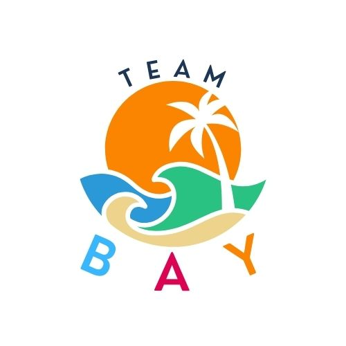

# School-Portfolio

I am John Herbert Yncierto, a 2nd year at MMCM in the CCIS BS CS course. After studying for 2 years as a computer science student, I was
able to learn skills and apply them in creating projects.

---
## Links to portfolio

- 1st year portfolio
[1st year portfolio](https://johnyncierto.my.canva.site/)

- Web application portfolio
[Web applications portfolio](https://johnyncierto.github.io)

---
## Latest Project: AquaAligned by Team BAY
[AquaAligned](https://github.com/LegionRevenant/Aqua-Aligned.git)

  

**Team BAY** members are John Herbert Yncierto, Dan Blair Bapilar, and John Lawrence Alovera.
We developed AquaAligned, an IoT and web application system that monitors a water tank's 
water level and temperature, and provides logging for historical data analysis.
---

